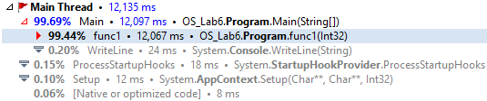

# Profiling

This simple C# program created for profiling purposes. In this project I profiled .NET Core application using dotTrace tool.

### Before 'optimization'
```
        static bool func1(int a)
        {
            for (int i = 0; i < 100000000; i++)
            {
                Thread.Sleep(100);
                if (i > a)
                    return true;
            }

            return false;
        }
        static bool func2()
        {
            for (int i = 0; i < 10; i++)
            {
                Thread.Sleep(100);
            }

            return true;
        }
        static bool func3()
        {
            for (int i = 0; i < 10; i++)
            {
                Thread.Sleep(100);
            }

            return true;
        }


        static void Main(string[] args)
        {
            Console.WriteLine("Inside main()");
            string typeOfShape;

            int i = 0;
            for (; i < 10; i++) ;
            {
                for (int j = 10; j > 0; j--)
                {
                    if (func1(i) || func2() || func3()){
                        Console.WriteLine("Inside if()");
                    }
                }
            }
        }
```


The profiling tool makes it clear that the bulk of the CPU time was spent executing the function func1().

### After 'optimization'


After deleting Thread.Sleep() method in func1() perfomance has significantly increased that we can clearly see in profiling tool.
